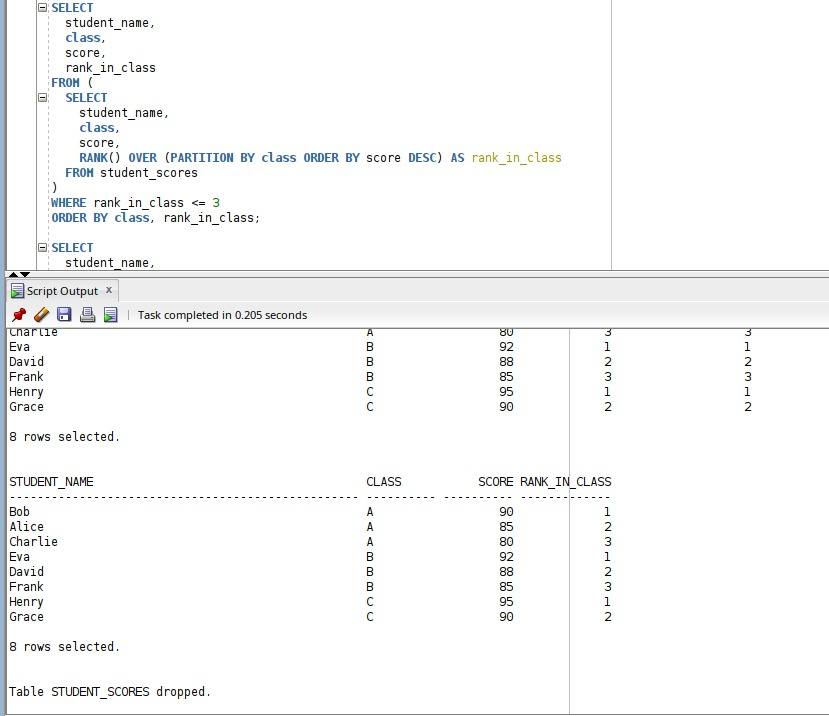

# A_Funny_Pl_Name
# A_Funny_Pl_Name

**Database Development with PL/SQL (INSY 8311) – Assignment II**  

*Created by*: Ibambasi Ganza Pierre Davy 26427

*Created by*: Rusibana Jean Paul 26473

*concentration*: software engineering 
1. Creating table and inserting data
   

   here we created and inserted data into a table using normal sql queries
