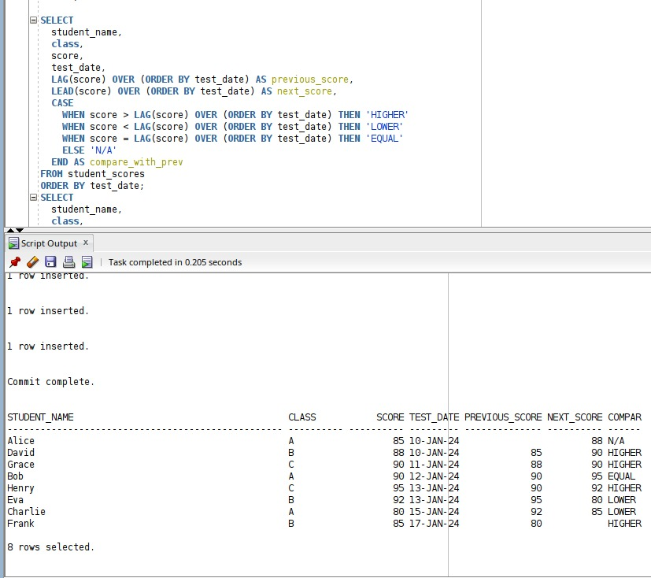
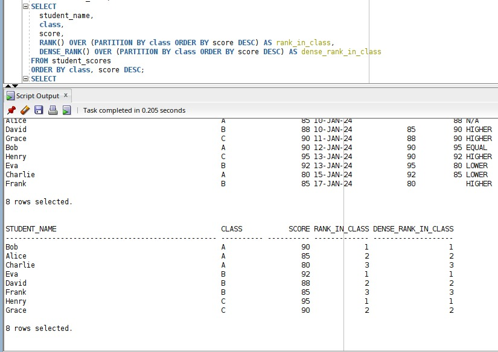
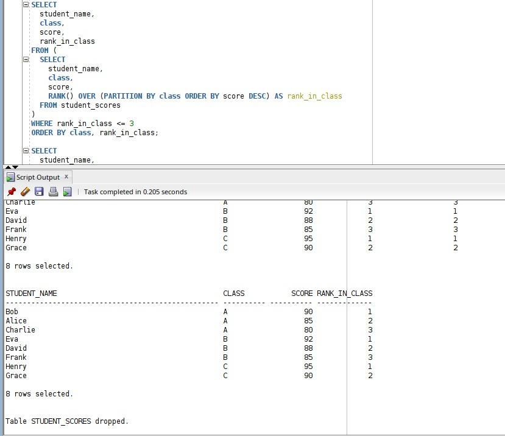

# A_Funny_Pl_Name
# A_Funny_Pl_Name

**Database Development with PL/SQL (INSY 8311) – Assignment II**  

*Created by*: Ibambasi Ganza Pierre Davy 26427

*Created by*: Rusibana Jean Paul 26473

*concentration*: software engineering 
1. Creating table and inserting data
   

   here we created and inserted data into a table using normal sql queries

2.Compare Values with Previous or Next Records

We used LAG() and LEAD() to access the previous and next scores for each student based on the test date.

This helps track score trends over time — useful in real-life for progress reports or identifying performance drops.

The CASE expression converts the comparison into words like HIGHER, LOWER, or EQUAL.

3. RANK() vs DENSE_RANK()
   

    We used RANK() and DENSE_RANK() to rank students by their score within each class.

The difference is:

RANK() skips numbers if there's a tie (e.g., 1, 1, 3)

DENSE_RANK() does not skip (e.g., 1, 1, 2)

🔍 Real-life application: Useful in sports ranking, academic results, leaderboards — anywhere categories and ties matter.
   

4. Fetch the Top 3 Records from Each Category

In this query, we retrieved the top 3 students from each class based on their scores.

We used RANK() to assign ranks based on scores in descending order.

Only the top 3 ranked students were selected.

Real-life application: This is useful for leaderboards, where we want to highlight top performers.
